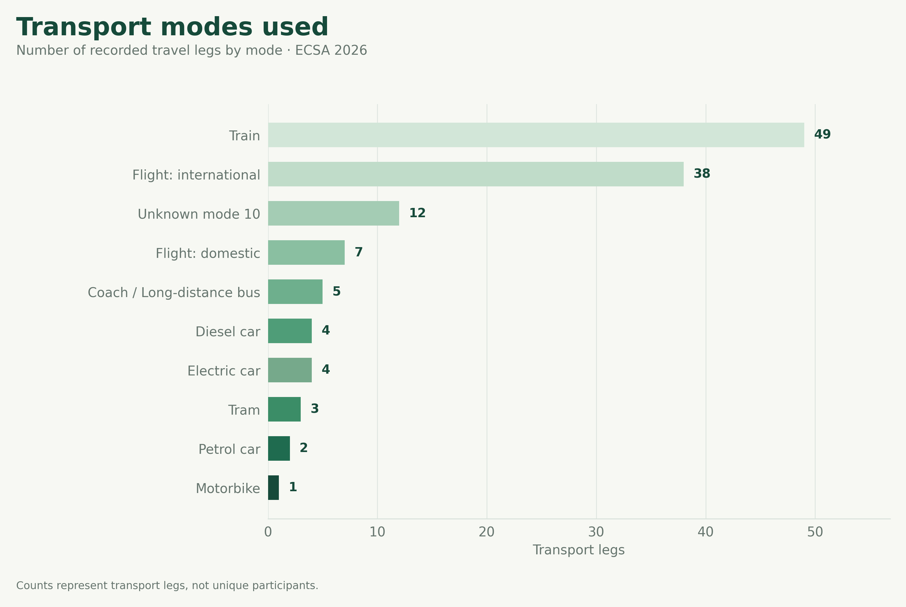
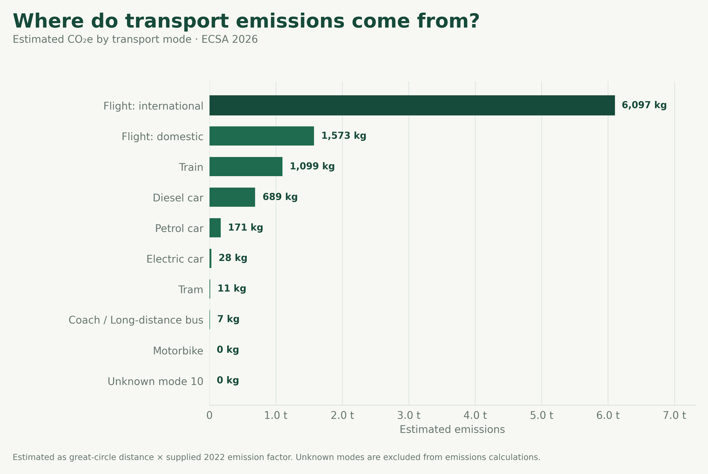
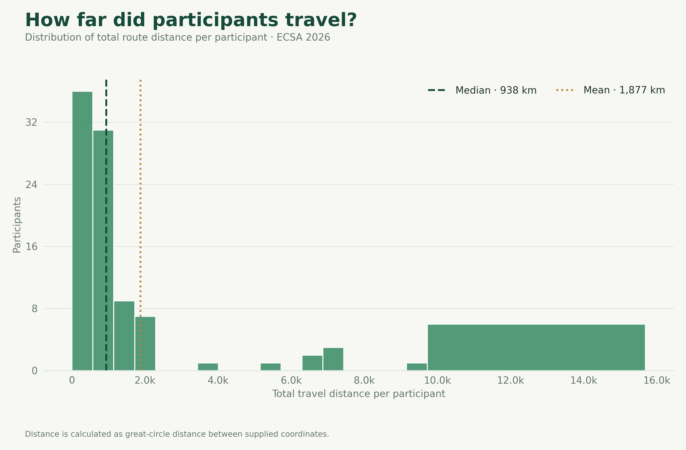
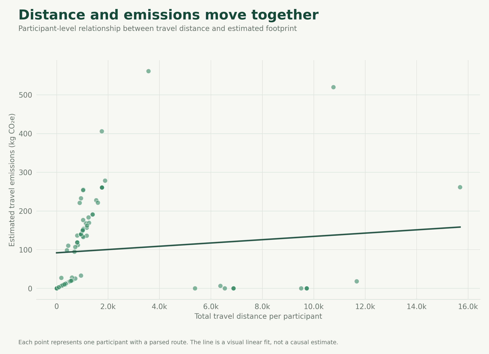
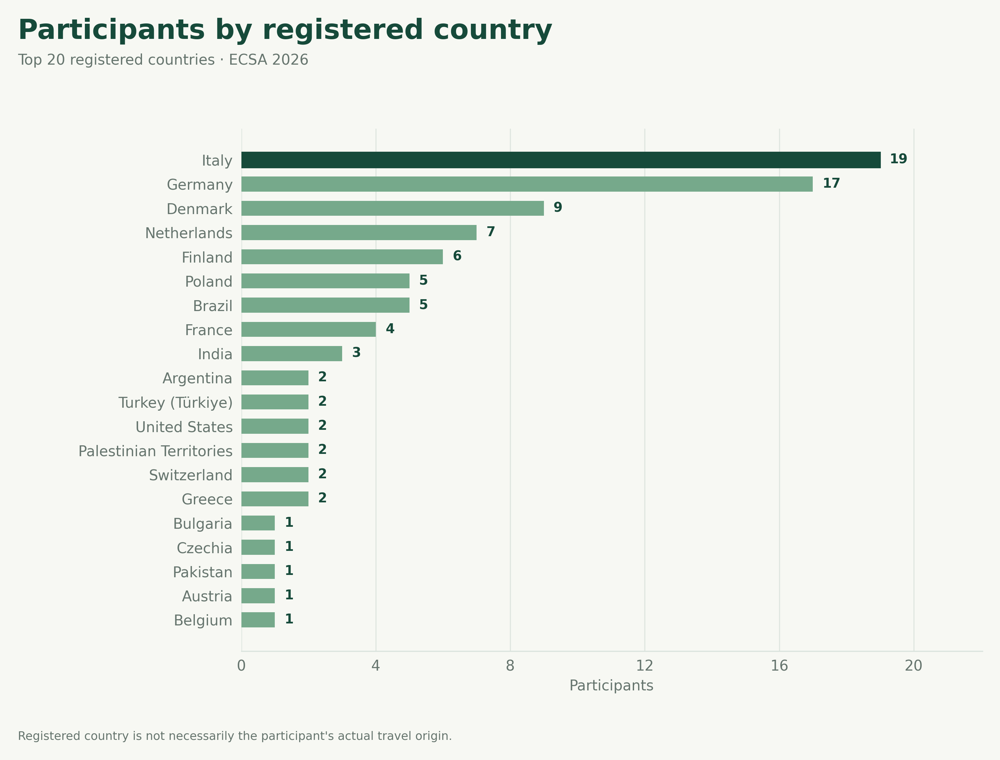

# SUSTConf Metrics

The **SUSTConf Metrics** project is an evolving evidence base for understanding how sustainability practices are being applied in academic conferences.

Rather than creating a ranking of conferences, the goal is to make sustainability **measurable, transparent, and progressively more useful**. Conferences adopting the SUSTConf Framework can contribute anonymous or aggregate data, allowing the community to understand what is happening in practice and, over time, which actions make a measurable difference.

---

## The first showcase

Our first dataset comes from **ECSA 2026**, the 20th European Conference on Software Architecture, taking place in Bolzano, Italy, from 7–11 September 2026.

ECSA provides an interesting starting point because its registration process already includes sustainability-related travel information. The current analysis focuses on **transportation**, one of the most significant sources of emissions associated with academic conferences.

The dataset currently contains **122 registration records**.

From these records, we can already explore several dimensions of conference travel:

- transport modes used by participants;
- estimated travel distances;
- estimated transport emissions;
- the relationship between distance and emissions;
- the geographic distribution of registered participants.

These are not yet the final SUSTConf Metrics. They are the **first showcase of what can be extracted from conference sustainability data**.

<strong>ECSA 2026 — transport at a glance</strong>

<h2>Key metrics</h2>

  

    <strong>122</strong>
    registration records
  

  

    <strong>49</strong>
    train journeys recorded
  

  

    <strong>38</strong>
    international flights recorded
  

  

    <strong>16,000+ km</strong>
    maximum participant travel distance
  

  

    <strong>6.1 t</strong>
    estimated emissions from international flights
  

<h2>What the first dataset tells us</h2>

<h3>1. Train travel is already a major part of the travel profile</h3>

The transport-mode data show that <strong>train travel is the most frequently
recorded transport mode</strong>, with 49 recorded train legs.

International flights are the second most frequent category, with 38 recorded legs.

This is an encouraging signal for the sustainability of conference travel,
but frequency alone does not tell the whole story. A small number of
long-distance flights can have a much larger climate impact than many
shorter journeys by rail or other low-carbon modes.

<h3>2. International flights dominate estimated transport emissions</h3>

The estimated emissions tell a very different story from the transport-mode distribution.

<ul>
  <li><strong>International flights:</strong> approximately <strong>6.1 t CO₂eq</strong></li>
  <li><strong>Domestic flights:</strong> approximately <strong>1.6 t CO₂eq</strong></li>
  <li><strong>Train:</strong> approximately <strong>1.1 t CO₂eq</strong></li>
  <li><strong>Diesel car:</strong> approximately <strong>0.7 t CO₂eq</strong></li>
  <li><strong>Petrol car:</strong> approximately <strong>0.17 t CO₂eq</strong></li>
</ul>

<blockquote>
<strong>The transport mode used most frequently is not necessarily the mode
responsible for the largest environmental impact.</strong>
</blockquote>

A useful metrics framework should help conference organizers identify
<strong>where interventions can have the greatest impact</strong>,
rather than simply reporting participation in sustainable transport.

<h3>3. Participants have very different travel distances</h3>

The distribution of travel distances is strongly skewed.

The <strong>median participant travel distance is approximately 938 km</strong>,
while the mean is considerably higher, at approximately <strong>1,877 km</strong>.

This difference is important: a relatively small number of participants
travel very long distances, creating a long tail in the distribution.

Future conference metrics could report both:

<ul>
  <li><strong>median travel distance</strong>, representing a typical participant;</li>
  <li><strong>mean travel distance</strong>, capturing the influence of long-distance travel;</li>
  <li>and potentially <strong>distance bands</strong>, making the distribution easier to compare between conferences.</li>
</ul>

<h3>4. Distance and emissions are related — but not perfectly</h3>

At participant level, longer journeys generally correspond to higher estimated emissions.

However, the relationship is not one-to-one.

Two participants travelling similar distances can have very different estimated
footprints depending on their transport mode. Conversely, a long-distance journey
by a lower-carbon mode can have a substantially smaller footprint than a shorter flight.

<blockquote>
<strong>Distance alone is not enough. We need to understand how participants travel.</strong>
</blockquote>

The long-term metrics framework should therefore connect
<strong>origin → distance → transport mode → estimated emissions</strong>
whenever the available data allow it.

<h3>5. ECSA already has an international participant base</h3>

The current dataset also provides a first picture of the geographical distribution
of registered participants.

Italy and Germany are the two largest registered-country groups, followed by
Denmark, the Netherlands, Finland, Poland, Brazil and France.

This geographical dimension becomes particularly valuable when combined with transport data.

---

## The next generation of metrics

Future datasets can progressively incorporate:

### 👥 Participation

- Number of participants
- Number of virtual participants
- Participant origin
- Geographic distribution
- Number of avoided trips through virtual participation

### 🚆 Transport

- Main transport mode
- Travel distance
- Transport emissions
- Share of low-carbon transport
- Share of participants travelling by rail/public transport
- Modal split

### 🏨 Accommodation

- Accommodation nights
- Accommodation footprint
- Average nights per participant
- Low-impact accommodation indicators

### 🍽️ Food

- Food-related emissions
- Vegetarian/vegan meal share
- Local or seasonal food indicators
- Food waste

### ♻️ Waste

- Waste generated
- Recycling/recovery rates
- Reusable vs. disposable materials
- Waste reduction measures

### 🏢 Venue

- Venue sustainability indicators
- Energy-related indicators
- Renewable energy use
- Accessibility and public-transport connectivity

---

# Join the metrics project

The SUSTConf Metrics project is designed to grow with the community.

If your conference is adopting the SUSTConf Framework, we invite you to contribute anonymous or aggregate sustainability data.

You do not need to publish personal information.

We are interested in **evidence at the conference level**, not individual participants.

We especially welcome data from:

- conferences using the framework for the first time;
- conferences that have used the framework in previous editions;
- multiple editions of the same conference;
- datasets covering both sustainability actions and measurable outcomes.

