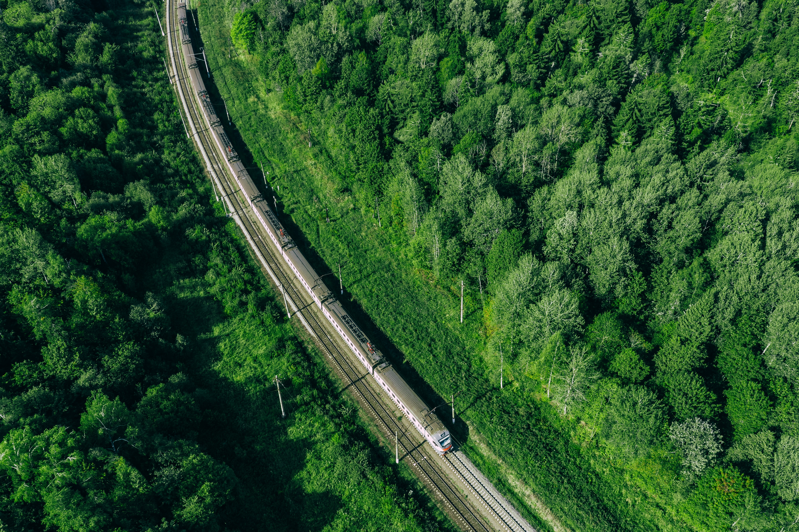
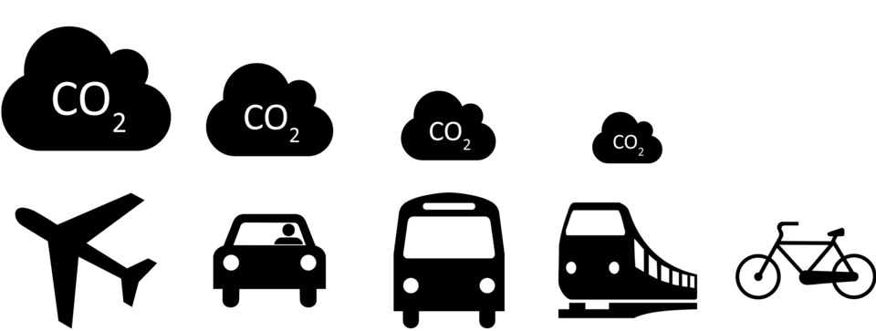

  

        <!-- Share a Resource -->
    

      

        

          
🤝

          <h3 class="card-title">Share a Resource</h3>

          

            Have a reusable resource that could help other conferences?
            Resource sharing is encouraged and welcome.
          

          

            <strong>Want to contribute?</strong>
            Contact the framework maintainers to have your resource added here.
          

          
p.lago at vu.nl

          
vinicius.dos.santos at usp.br

        

      

    

    <!-- Sustainability Campaign -->
    

      

        

          

          <h3 class="card-title">Sustainability Campaign</h3>

          

            Announce to everyone your commitment to sustainability and make
            your attendants more engaged to sustainability.
          

          <a href="{{ '/sustainability-campaign/' | relative_url }}"
             class="btn btn-success">
            Explore the campaign
          </a>
        

      

    

    <!-- Carbon Footprint Calculator -->
    

    

        

        

            
        

        <h3 class="card-title">Carbon Footprint Calculator</h3>

        

            Help your conference understand the environmental impact of
            participant travel and collect data to support more sustainable
            decisions.
        

        <a
            href="{{ '/carbon-footprint-calculator/' | relative_url }}"
            class="btn btn-success">
            Explore the calculator
        </a>
        

    

    

  

